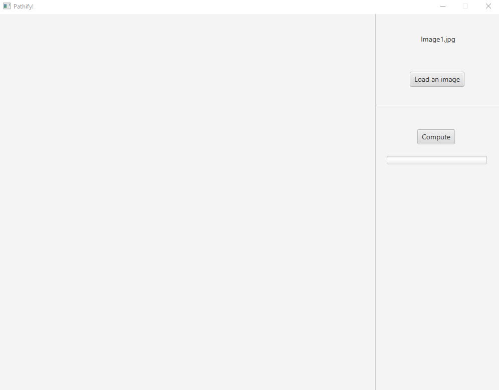
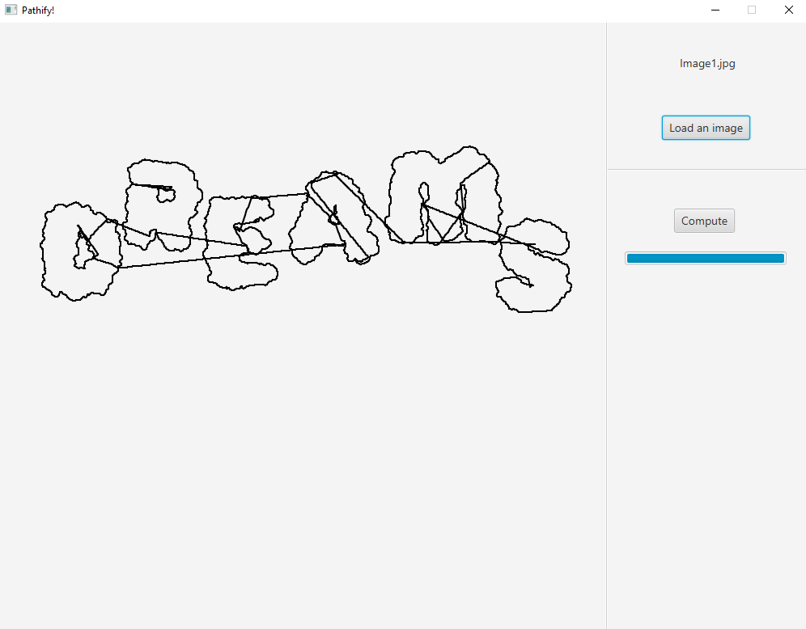
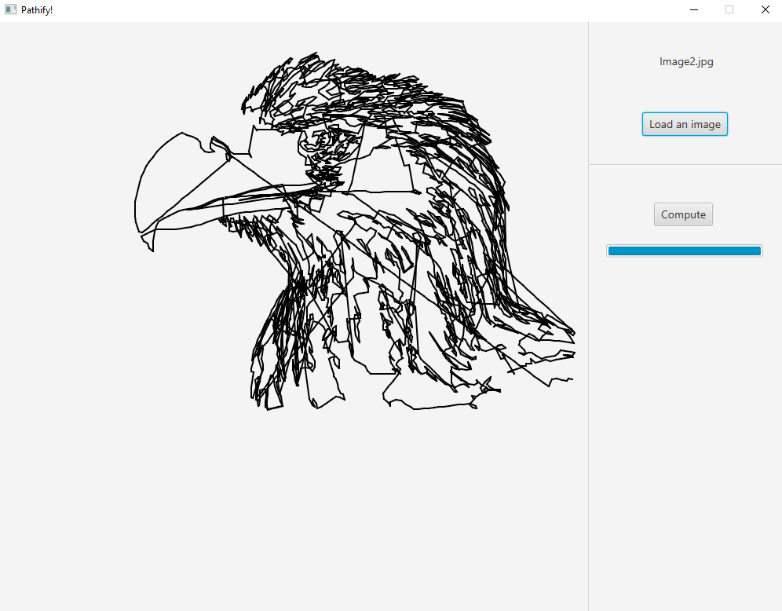
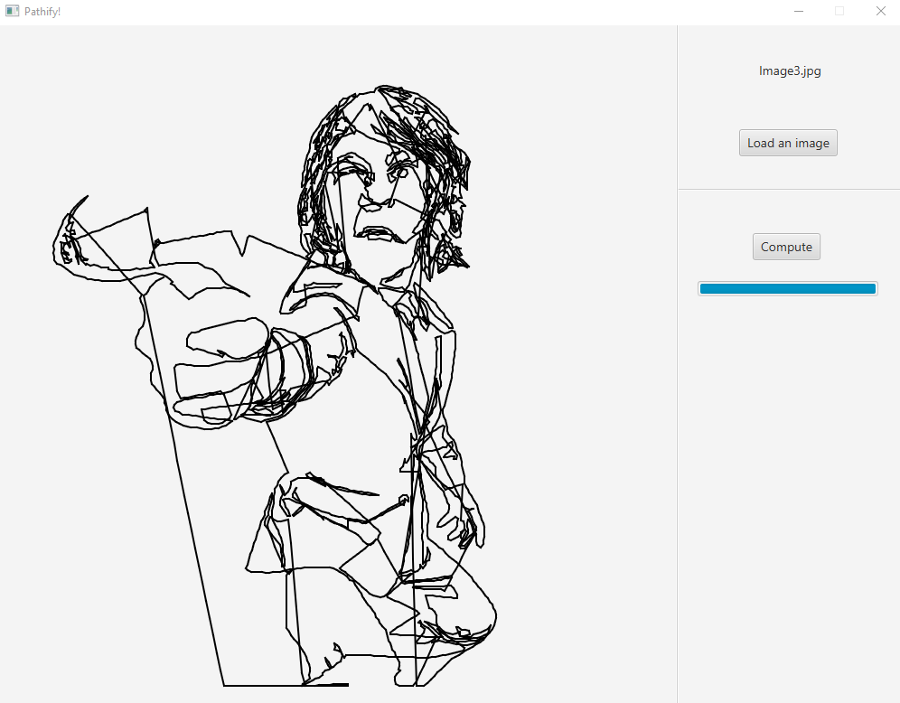

# Pathify

App meant to create sketch from and image in a single stroke. It utilizes [PathifyCore](https://github.com/TheKiromen/PathifyCore) for path detection, then visualizes it in the window.
Works best for high contrast images. Depending on your computer it may take few seconds to process very large images.

## Demo

[Executable](https://drive.google.com/file/d/1bYjdpUUySQBQMLppQ_O6uP-9kMCQUVsY/view?usp=sharing) - comes bundled with Java, just extract and run.

## Screenshots

## Features

- Image selection
- Image to single path conversion
- Animated sketch

## Technologies

- Java
- JavaFX
- [PathifyCore](https://github.com/TheKiromen/PathifyCore)

## Authors

- [@dkrucze](https://github.com/TheKiromen)
